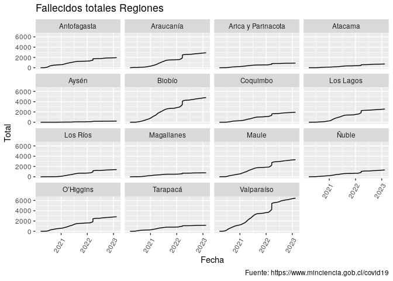

# COVID 19 en Chile

Ejemplo de uso de datos de COVID recopilados por el Ministerio de
Ciencia de Chile <https://www.minciencia.gob.cl/covid19>

## Regionales Diarios

``` r
fn <- tempfile(fileext = ".csv")
total_region <- download.file(
  "https://github.com/MinCiencia/Datos-COVID19/raw/master/output/producto3/TotalesPorRegion_std.csv",
  destfile = fn,
  method = "wget",
  timeout = 60
)

library(data.table)
datos<- fread(fn)
datos[, Fecha := as.IDate(Fecha)]
```

## Visualización

``` r
library(ggplot2)
ggplot(
  datos[Categoria == "Fallecidos totales" & !Region %in% c("Total", "Metropolitana")],
  aes(x = Fecha, y = Total)
  ) +
  geom_line() +
  facet_wrap(vars(Region)) +
  labs(title = "Fallecidos totales", caption = "Fuente: https://www.minciencia.gob.cl/covid19")
```

    ## Warning: Removed 19 row(s) containing missing values (geom_path).

<!-- -->

``` r
library(ggplot2)
ggplot(
  datos[Region == "Total" & !Categoria %in% c("Casos acumulados", "Casos confirmados recuperados", "Casos probables acumulados")],
  aes(x = Fecha, y = Total)
  ) +
  geom_line(aes(color = Categoria)) +
  labs(title = "Totales a nivel nacional", caption = "Fuente: https://www.minciencia.gob.cl/covid19")
```

    ## Warning: Removed 403 row(s) containing missing values (geom_path).

<!-- -->
