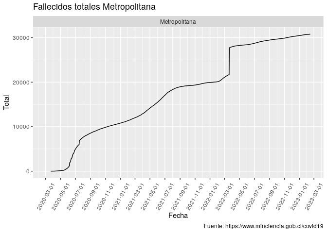
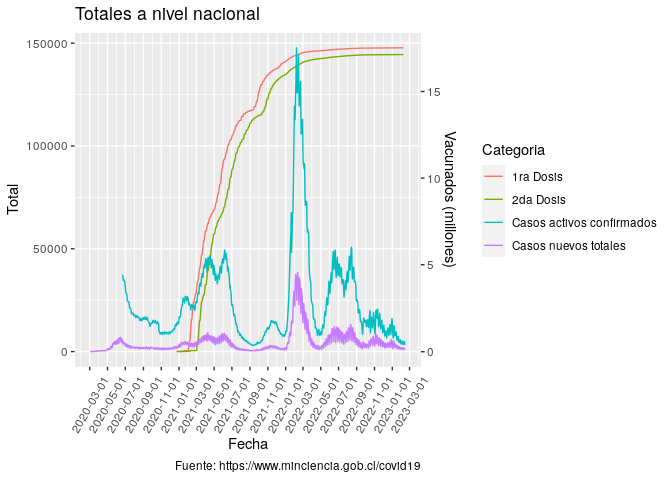
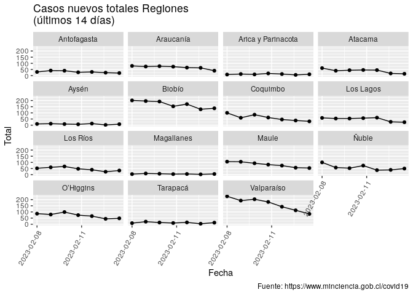
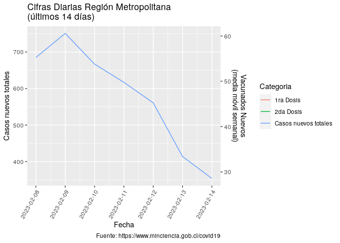
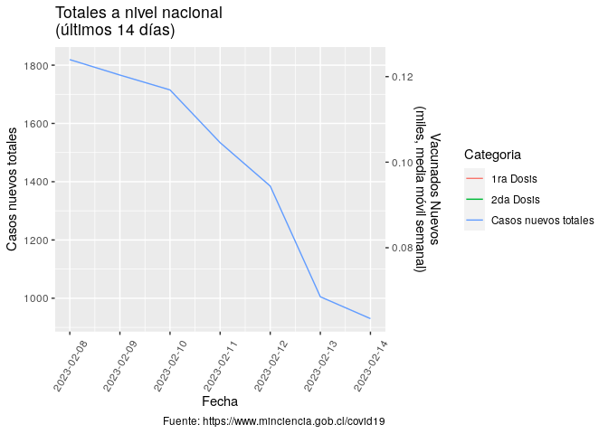

# COVID 19 en Chile 

Ejemplo de uso de total\_casos de COVID recopilados por el Ministerio de
Ciencia de Chile <https://www.minciencia.gob.cl/covid19>. Última
actualización: 2021-08-01

## Visualización desde el comienzo de la pandemia

<!-- --><!-- -->

<!-- -->

## Visualización últimas 2 semanas

<!-- --><!-- -->

<!-- -->
